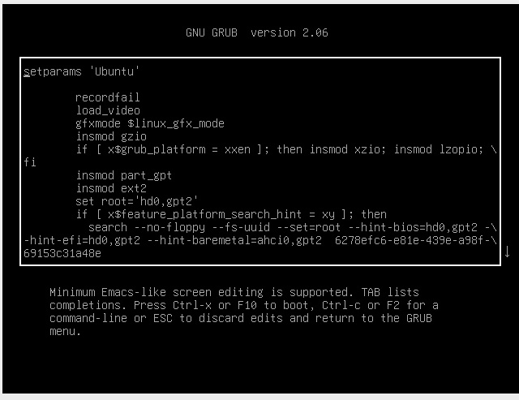
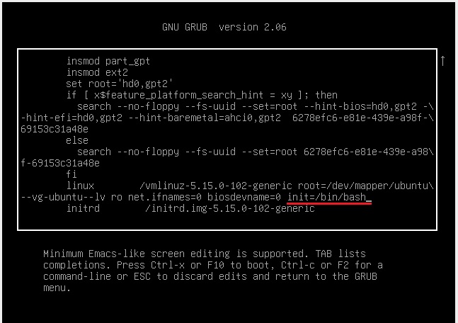
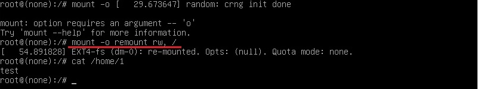
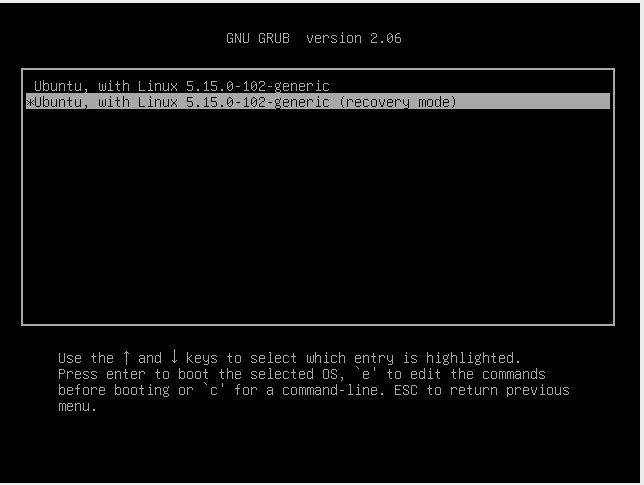
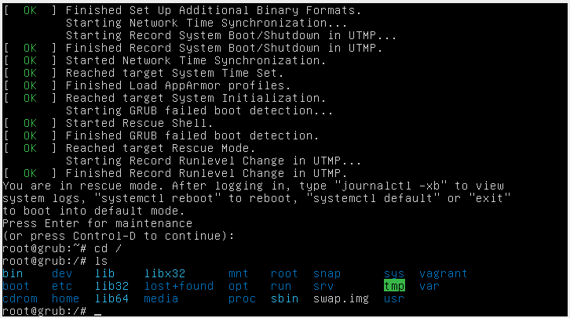
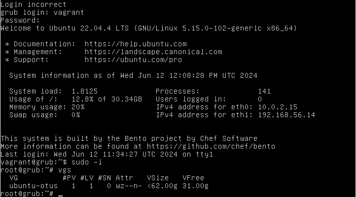
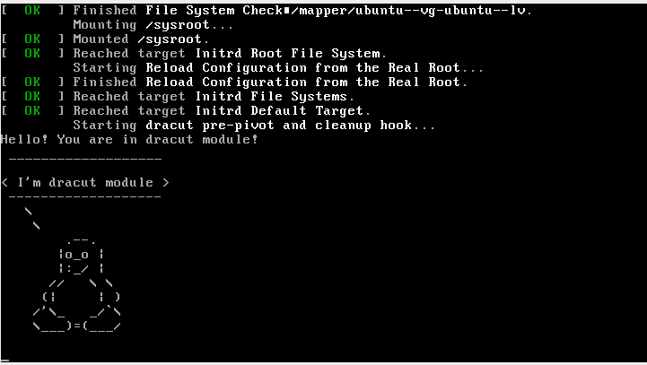

# Домашняя работа: Работа с загрузчиком

Цель работы: Изучить загрузку системы

Что нужно сделать?

- Включить отображение меню Grub
- Попасть в систему без пароля несколькими способами
- Установить систему с LVM, после чего переименовать VG
- Добавить модуль в initrd

# Выполнение

## Создаём виртуальную машину

Создаю в домашней директории Vagrantfile, собираю стенд.
 
## Включаем отображение меню Grub

Для отображения меню нужно отредактировать конфигурационный файл:

``` root@grub:~# vi /etc/default/grub ```

``` 
#GRUB_TIMEOUT_STYLE=hidden
GRUB_TIMEOUT=10
```
Обновляем конфигурацию загрузчика и перезагружаемся для проверки:
```
root@grub:~# update-grub
Sourcing file `/etc/default/grub'
Sourcing file `/etc/default/grub.d/init-select.cfg'
Generating grub configuration file ...
Found linux image: /boot/vmlinuz-5.15.0-102-generic
Found initrd image: /boot/initrd.img-5.15.0-102-generic
Warning: os-prober will not be executed to detect other bootable partitions.
Systems on them will not be added to the GRUB boot configuration.
Check GRUB_DISABLE_OS_PROBER documentation entry.
done
root@grub:~# reboot
```

## Попасть в систему без пароля несколькими способами

Открываем GUI VirtualBox , запускаем виртуальную машину и при выборе ядра для загрузки нажимаем e - в данном контексте edit. 
Попадаем в окно, где мы можем изменить параметры загрузки:



Способ № 1. init=/bin/bash
В конце строки, начинающейся с linux, добавляем init=/bin/bash и нажимаем сtrl-x для загрузки в систему:



Рутовая файловая система при этом монтируется в режиме Read-Only. Для монтирования ее в режим Read-Write вводим команду:



Способ №2. Recovery mode

В меню загрузчика на первом уровне выбираем второй пункт (Advanced options…), далее выбираем пункт меню с указанием recovery mode в названии. 



Далее прогружаемся в рутовую консоль:



## Установка системы с LVM, переименование VG

Смотрим текущее состояние системы и переименовываем VG:
```
root@grub:~# vgs
  VG        #PV #LV #SN Attr   VSize   VFree 
  ubuntu-vg   1   1   0 wz--n- <62.00g 31.00g
root@grub:~# vgrename ubuntu-vg ubuntu-otus
  Volume group "ubuntu-vg" successfully renamed to "ubuntu-otus"
```

Далее правим /boot/grub/grub.cfg. Везде заменяем старое название VG на новое:

```
linux   /vmlinuz-5.15.0-102-generic root=/dev/mapper/ubuntu--otus-ubuntu--lv ro net.ifnames=0 biosdevname=0
```
Перезагружаемся и проверяем:



## Добавить модуль в initrd

Устанавливаем dracut:

``` root@grub:~# apt install dracut ```

Скрипты модулей хранятся по пути: /usr/lib/dracut/modules.d/. Создадим в директории папку "01test" и
в ней фаилы скриптов: module-setup.sh и test.sh.

В фаил module-setup.sh и test.sh добавим следующее содержимое:

```
root@grub:~# mkdir /usr/lib/dracut/modules.d/01test
root@grub:~# vi /usr/lib/dracut/modules.d/01test/module-setup.sh
````
``` 
#!/bin/bash

check() { # Функция, которая указывает что модуль должен быть включен по умолчанию
    return 0
}

depends() { # Выводит все зависимости от которых зависит наш модуль
    return 0
}

install() {

    inst_hook cleanup 00 "${moddir}/test.sh" # Запускает скрипт
}

```
```
root@grub:~# vi /usr/lib/dracut/modules.d/01test/test.sh
```
```
#!/bin/bash

exec 0<>/dev/console 1<>/dev/console 2<>/dev/console
cat <<'msgend'
Hello! You are in dracut module!
 ___________________

< I'm dracut module >
 -------------------
   \
    \
        .--.
       |o_o |
       |:_/ |
      //   \ \
     (|     | )
    /'\_   _/`\
    \___)=(___/

msgend
sleep 10
echo " continuing...."
```
Пересоздаём initrd:

``` root@grub:~# dracut -f -v ```

Обновляем конфигурацию загрузчика и перезагружаемся для проверки:
```
root@grub:~# update-grub
root@grub:~# update-grub
Sourcing file `/etc/default/grub'
Sourcing file `/etc/default/grub.d/init-select.cfg'
Generating grub configuration file ...
Found linux image: /boot/vmlinuz-5.15.0-102-generic
Found initrd image: /boot/initrd.img-5.15.0-102-generic
Warning: os-prober will not be executed to detect other bootable partitions.
Systems on them will not be added to the GRUB boot configuration.
Check GRUB_DISABLE_OS_PROBER documentation entry.
done

root@grub:~# reboot
```

